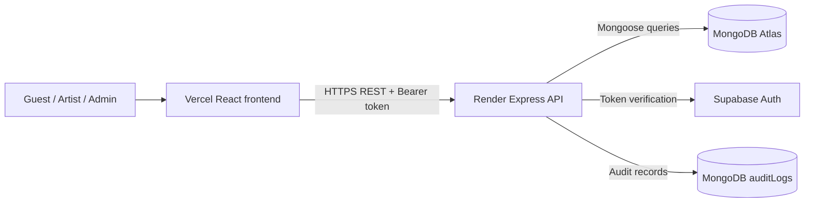

# ArtVault Checkpoint 2 Documentation Content

## 1. Project overview

**Project:** ArtVault Art Gallery Management and Exhibition System

**Problem addressed:** Small galleries need one place to publish artwork,
maintain artist profiles, organize exhibits, and manage archived content.

**Target users:** Guests, artists, sub-administrators, and the main
administrator.

**Main purpose:** Provide a secure, deployed gallery platform where MongoDB
stores application data and Supabase Auth verifies user identity.

**Major features:** Public gallery browsing, artist profiles, artwork upload
and management, exhibit curation, archives, role management, profile/security
settings, image validation, and responsive navigation.

## 2. MERN architecture

React renders the interface and sends REST requests through Axios. Express
routes requests to controllers, middleware validates the token/role, and
Mongoose reads or writes MongoDB Atlas. Supabase is used for authentication;
application profiles, artworks, exhibits, archives, and audit logs remain in
MongoDB.

## 2.1 Request-response example

1. An artist submits the upload form in React.
2. Axios sends `POST /api/artworks` with a Bearer token.
3. Express applies Helmet, CORS, rate limiting, JSON limits, and auth middleware.
4. Supabase verifies the token and the user is mirrored into MongoDB if needed.
5. The controller validates title, description, categories, materials, and image data.
6. Mongoose stores the artwork in MongoDB Atlas and an audit record is created.
7. The API returns the saved artwork; React updates the gallery without a reload.

## 3. Main REST resources

| Resource | Methods | Protection |
| --- | --- | --- |
| Auth | `POST /api/auth/signup`, `POST /api/auth/login`, `GET /api/auth/me` | Login/signup public; `me` protected |
| Artworks | `GET /api/artworks`, `GET /api/artworks/:id`, `GET /api/artworks/:id/image` | Public reads |
| Artworks | `POST`, `PUT`, `DELETE /api/artworks/:id` | Authenticated; writes owner/admin restricted |
| Artists | `GET /api/artists`, `GET /api/artists/:id` | Public reads |
| Artists | `PUT/DELETE /api/artists/me` | Authenticated owner |
| Exhibits | `GET /api/exhibits`, `GET /api/exhibits/:id` | Public reads |
| Exhibits | `POST`, `PUT`, `DELETE /api/exhibits/:id` | Administrator |
| Archives | `GET /api/archives`, restore, permanent delete | Administrator |
| Audit logs | `GET /api/audit-logs` | Administrator |

## 4. Database design

| Collection | Purpose | Relationships/security |
| --- | --- | --- |
| `artists` | Accounts and public profiles | Artwork references artist; password and Supabase ID excluded by default |
| `artworks` | Artwork metadata and validated image data | References artist; writes require owner/admin authorization |
| `exhibits` | Curated shows and event dates | References many artworks; writes require admin |
| `archives` | Recoverable deleted snapshots | Admin-only access |
| `auditlogs` | Who/what/when content-change history | Admin-only access |

## 5. RBAC matrix

| Function | Guest | Artist | Sub-admin | Main admin |
| --- | --- | --- | --- | --- |
| Browse public content | Yes | Yes | Yes | Yes |
| Create artwork | No | Yes | Yes | Yes |
| Update/delete own artwork | No | Yes | Yes | Yes |
| Manage all gallery content | No | No | Yes | Yes |
| Manage exhibits | No | No | Yes | Yes |
| Manage artists | No | No | Yes | Yes |
| Change admin roles | No | No | No | Yes |
| Manage archives | No | No | Yes | Yes |
| View audit logs | No | No | Yes | Yes |

Replace the placeholder links in the template with the actual GitHub, Vercel,
and Render URLs before submission.
